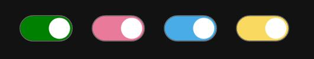

# SlideToggleButton 控件说明

## 概述
`SlideToggleButton` 是一个自定义 WPF 控件，用于表示开关状态。它结合了按钮点击和滑块滑动的交互方式，允许用户通过**点击**或**滑动**操作来切换开关状态。


## 核心功能
1.  **状态切换**：通过点击或滑动操作改变 `IsChecked` 状态 (`true`/`false`)。
2.  **命令支持**：实现 `ICommandSource` 接口，支持绑定：
    *   `Command`
    *   `CommandParameter`
    *   `CommandTarget`
3.  **事件**：
    *   `Click`：按钮被有效点击时触发。
    *   `Checked`：当 `IsChecked` 从 `false` 变为 `true` 时触发。
    *   `Unchecked`：当 `IsChecked` 从 `true` 变为 `false` 时触发。
4.  **外观定制**：提供以下 `DependencyProperty` 属性用于自定义视觉外观和动画：
    *   `TrackCornerRadius`
    *   `CheckedTrackColor` (开关开启时的轨道颜色)
    *   `UncheckedTrackColor` (开关关闭时的轨道颜色)
    *   `ThumbColor` (滑块颜色)
    *   `Width`
    *   `Height`
    *   *(外观更改后控件行为保持正常)*

## 行为与事件触发规则
*   **`Click` 事件**：仅在鼠标按下点与释放点之间的距离 **小于 5 个逻辑像素** 时触发。距离 **大于或等于 5 个逻辑像素** 的操作被视为滑动，不会触发 `Click`。
*   **`Checked` / `Unchecked` 事件**：
    *   当 `IsChecked` 属性值发生相应变化时触发 (`false` -> `true` 触发 `Checked`; `true` -> `false` 触发 `Unchecked`)。
    *   可能由用户**点击**、**滑动**操作触发。
    *   也可能由**直接代码赋值** `IsChecked` 属性触发。

## 可重写方法 (基类扩展)
作为基类时，可以重写以下方法以自定义行为：
*   `protected virtual void OnClick();` *(注意：重写时未调用基类实现 (`base.OnClick()`) 将阻止 `Click` 事件触发！)*
*   `protected virtual void OnChecked(RoutedEventArgs e);` *(注意：重写时未调用基类实现 (`base.OnChecked(e)`) 将阻止 `Checked` 事件触发！)*
*   `protected virtual void OnUnchecked(RoutedEventArgs e);` *(注意：重写时未调用基类实现 (`base.OnUnchecked(e)`) 将阻止 `Unchecked` 事件触发！)*
*   `protected virtual void OnToggle();` *(重写此方法**无需**调用基类实现 (`base.OnToggle()`))*
*   *(同时可重写继承自 `Thumb` 基类的相关方法)*

## 自定义 ControlTemplate 关键要求
1.  **动画状态管理**：
    *   强烈建议使用 `VisualStateManager` 定义状态过渡动画。
    *   `Checked`, `Unchecked`, `Reset` 这三个视觉状态 (`VisualState`) **必须**定义在同一个 `VisualStateGroup` 内。
    *   该 `VisualStateGroup` **不应**包含 `Normal` 状态 (通常属于另一个状态组)。
2.  **必需部件**：
    *   在视觉树中**必须**保留一个名为 `PART_Thumb` 的 `Border` 元素。
    *   此 `Border` **必须**设置属性：`RenderTransform="{TemplateBinding ThumbTransform}"`。这是控件实现滑块滑动功能的核心依赖。
    ```xaml
    <Border x:Name="PART_Thumb" RenderTransform="{TemplateBinding ThumbTransform}" ... />
    ```

## 尺寸建议
为了获得最佳视觉和交互效果，建议遵循以下比例关系：
*   `Width > Height` (使用`RenderTransform`属性可以实现垂直样式)
*   `1.5 * Height <= Width <= 2 * Height`

## 可能出现的问题
通过附加属性来改变`VisualState.Storyboard`中的**动画目标值**，虽然已经实现并且暂未出现bug，但是个人觉得当前实现的方式不够稳定，局限性较大，可能会出现动画颜色错误的问题（仅影响视觉，**不会**导致崩溃）

---